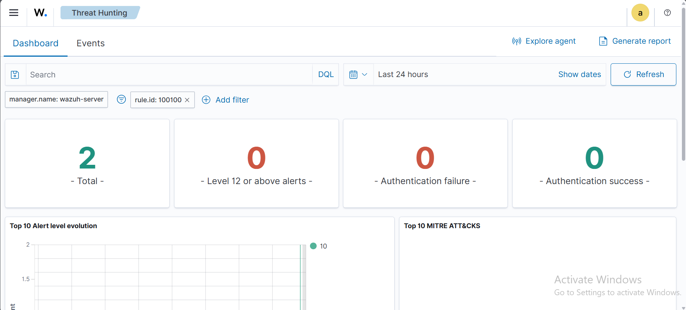
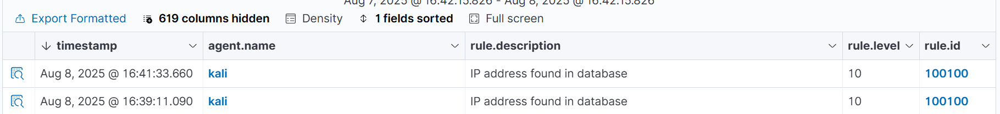

# Blocking a Known Malicious Actor with Wazuh

This guide demonstrates how to block a specific IP address from accessing web resources hosted on a victim server using Wazuh's CDB list capability.

---

## 🖥️ Setup Overview

- **Kali Linux**: Acts as the **victim endpoint**, running an Apache server.
- **Ubuntu**: Acts as the **attacker**, trying to connect to the victim's web server.
- **Wazuh Server**: Monitors logs, detects malicious activity, and blocks the attacker using active response.

---

## ⚙️ Configuration: Kali Linux (Victim Server)

### 1. Install Apache Web Server
```bash
sudo apt update
sudo apt install apache2
sudo systemctl status apache2
````

### 2. Test Apache Web Server

```bash
curl http://<KALI_IP_ADDRESS>
```

### 3. Configure Wazuh Agent to Monitor Apache Logs

Edit the ossec.conf file:

```bash
sudo nano /var/ossec/etc/ossec.conf
```

Add the following inside the `<ossec_config>` block:

```xml
<localfile>
  <log_format>syslog</log_format>
  <location>/var/log/apache2/access.log</location>
</localfile>
```

### 4. Restart Wazuh Agent

```bash
sudo systemctl restart wazuh-agent
```

---

## ⚙️ Configuration: Wazuh Server

### 1. Install wget

```bash
sudo yum update && sudo yum install -y wget
```

### 2. Download AlienVault IP Reputation List

```bash
sudo wget https://github.com/firehol/blocklist-ipsets/blob/master/blocklist_de_bruteforce.ipset -O /var/ossec/etc/lists/alienvault_reputation.ipset
```

### 3. Add Attacker IP Address to the List

```bash
echo "<Attacker_IP>" | sudo tee -a /var/ossec/etc/lists/alienvault_reputation.ipset
```

### 4. Download Script to Convert IP List to CDB Format

```bash
sudo wget https://wazuh.com/resources/iplist-to-cdblist.py -O /tmp/iplist-to-cdblist.py
```

### 5. Convert to CDB Format

```bash
sudo /var/ossec/framework/python/bin/python3 /tmp/iplist-to-cdblist.py /var/ossec/etc/lists/alienvault_reputation.ipset /var/ossec/etc/lists/blacklist-alienvault
```

### 6. Set Proper Permissions

```bash
sudo chown wazuh:wazuh /var/ossec/etc/lists/blacklist-alienvault
```

### 7. Add Custom Rule

Edit:

```bash
sudo nano /var/ossec/etc/rules/local_rules.xml
```

Add:

```xml
<group name="attack,">
  <rule id="100100" level="10">
    <if_group>web|attack|attacks</if_group>
    <list field="srcip" lookup="address_match_key">etc/lists/blacklist-alienvault</list>
    <description>IP address found in AlienVault reputation database.</description>
  </rule>
</group>
```

### 8. Add List to Ruleset

Edit:

```bash
sudo nano /var/ossec/etc/ossec.conf
```

Add inside `<ruleset>`:

```xml
<list>etc/lists/blacklist-alienvault</list>
```

Example:

```xml
<ossec_config>
  <ruleset>
    <!-- Default ruleset -->
    <decoder_dir>ruleset/decoders</decoder_dir>
    <rule_dir>ruleset/rules</rule_dir>
    <rule_exclude>0215-policy_rules.xml</rule_exclude>
    <list>etc/lists/audit-keys</list>
    <list>etc/lists/amazon/aws-eventnames</list>
    <list>etc/lists/security-eventchannel</list>
    <list>etc/lists/blacklist-alienvault</list>

    <!-- User-defined ruleset -->
    <decoder_dir>etc/decoders</decoder_dir>
    <rule_dir>etc/rules</rule_dir>
  </ruleset>
</ossec_config>
```

### 9. Configure Active Response

Also in `ossec.conf`, add:

```xml
<ossec_config>
  <active-response>
    <command>firewall-drop</command>
    <location>local</location>
    <timeout>60</timeout>
  </active-response>
</ossec_config>
```

### 10. Restart Wazuh Manager

```bash
sudo systemctl restart wazuh-manager
```

---

## 🧪 Attack Emulation

From the attacker machine (Ubuntu), run:

```bash
curl http://<KALI_IP_ADDRESS>
```

---

## 📊 Visualize Alerts in Wazuh Dashboard

Navigate to **Threat Hunting** module and filter using:

```
rule.id:100100
```

You will see alerts generated when the attacker’s IP appears in the monitored logs and is matched against the blacklist.

---




