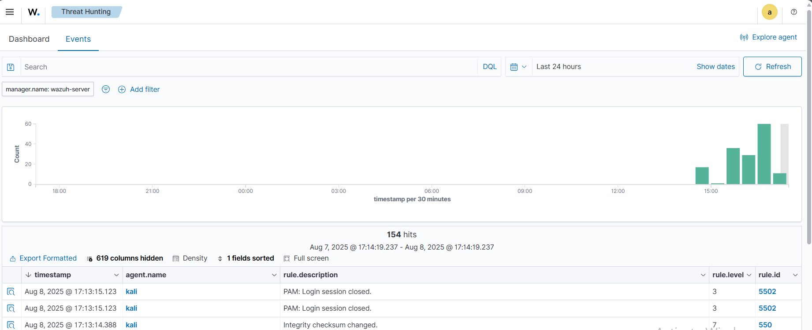

Here’s your guide cleaned up for grammar, consistency, and better Markdown formatting:

---

# 🚨 Detecting Brute-Force Attacks with Wazuh

Wazuh detects brute-force attacks by **correlating multiple authentication failure events**.
In this use case, we demonstrate how Wazuh detects brute-force attacks on a **Kali Linux** endpoint.

---

## 🖥️ Infrastructure

| Endpoint       | Description                                                                                |
| -------------- | ------------------------------------------------------------------------------------------ |
| **Ubuntu**     | Attacker endpoint used to perform brute-force attacks. Requires an SSH client.             |
| **Kali Linux** | Victim endpoint for SSH brute-force attacks. Requires an SSH server installed and enabled. |

---

## ⚙️ Configuration (Attacker Endpoint)

Perform the following steps on the **Ubuntu attacker endpoint** to simulate authentication failures against monitored endpoints.

### 1. Install Hydra

```bash
sudo apt update
sudo apt install -y hydra
```

### 2. Create a Password List

Create a text file containing **10 random passwords**:

```bash
nano PASSWD_LIST.txt
```

Add the passwords (one per line) and save the file.

---

## 🧪 Attack Emulation

### 🔹 SSH Brute-Force (Against Kali Linux)

Replace `<LINUX_IP>` with the IP address of the **Kali Linux** endpoint:

```bash
sudo hydra -l badguy -P PASSWD_LIST.txt <LINUX_IP> ssh
```

---

## 📊 Visualizing Alerts in Wazuh

1. Open the **Threat Hunting** module in the Wazuh dashboard.
2. Use the following filter to query Linux brute-force alerts:

   ```
   rule.id:(5502)
   ```



---


