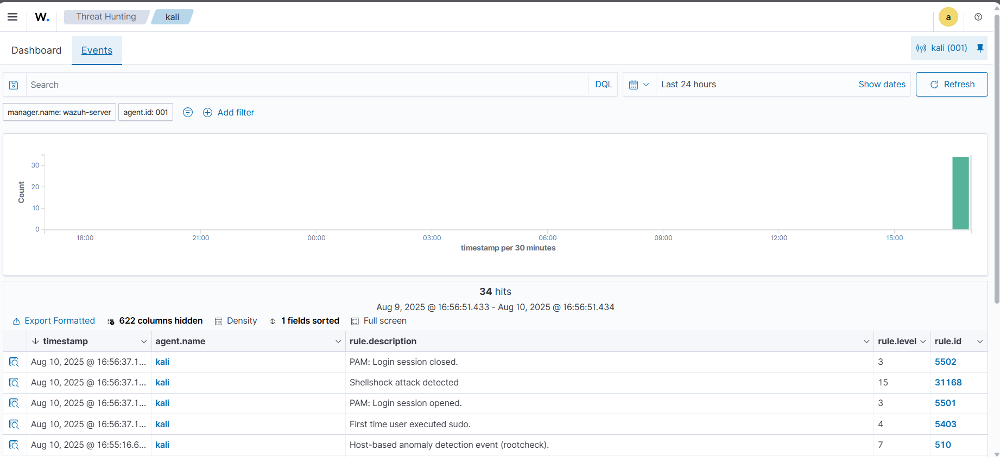

# 🛡️ Detecting a Shellshock Attack with Wazuh

Wazuh can detect **Shellshock** attacks by analyzing Apache web server logs from a monitored endpoint.

**Shellshock** (CVE-2014-6271) is a vulnerability in GNU Bash that allows remote code execution via maliciously crafted environment variables.

In this PoC, we simulate a Shellshock attack against a **Kali Linux** endpoint and detect it with Wazuh.

---

## 📡 Infrastructure

| Role       | OS / Version                        | Description |
|------------|-------------------------------------|-------------|
| Victim     | **Kali Linux** (Apache 2.4.54)       | Runs vulnerable web server |
| Attacker   | **Ubuntu 22.04**                    | Sends malicious HTTP request |

---

## ⚙️ Configuration on Kali Linux Endpoint

1. **Update packages & install Apache**
   ```bash
   sudo apt update
   sudo apt install apache2

2. **(Optional) Allow Apache in firewall**
   Skip if firewall is disabled:

   ```bash
   sudo ufw app list
   sudo ufw allow 'Apache'
   sudo ufw status
   ```

3. **Verify Apache is running**

   ```bash
   sudo systemctl status apache2
   ```

4. **Configure Wazuh Agent to monitor Apache logs**
   Edit `/var/ossec/etc/ossec.conf` and add:

   ```xml
   <localfile>
       <log_format>syslog</log_format>
       <location>/var/log/apache2/access.log</location>
   </localfile>
   ```

5. **Restart Wazuh Agent**

   ```bash
   sudo systemctl restart wazuh-agent
   ```

---

## 🚀 Attack Emulation from Ubuntu Attacker

From the **Ubuntu** machine, replace `<KALI_IP>` with the victim's IP and run:

```bash
sudo curl -H "User-Agent: () { :; }; /bin/cat /etc/passwd" <KALI_IP>
```

---

## 📊 Expected Detection

* **Wazuh Rule Match:**

  ```
  rule.description:Shellshock attack detected
  ```

---

## 🔍 Viewing Alerts in Wazuh Dashboard

Go to **Threat Hunting** and search:

```
rule.description:Shellshock attack detected
```

