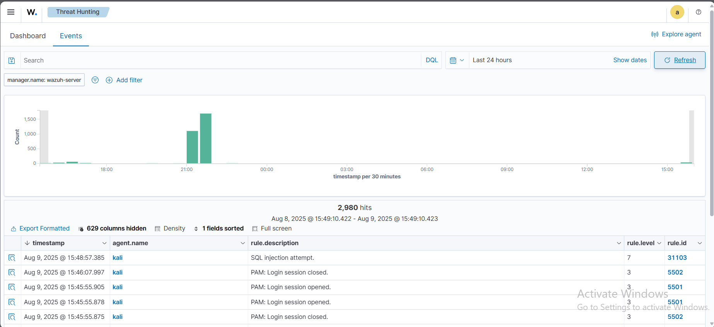

# 🛡️ Detecting an SQL Injection Attack with Wazuh

Wazuh can detect **SQL injection attacks** from web server logs containing suspicious patterns like `SELECT`, `UNION`, and other common SQL injection keywords.

SQL injection (SQLi) is an attack where a threat actor inserts malicious code into database queries. Successful SQLi can give unauthorized access to sensitive data.

In this PoC, we simulate an SQL injection attack against a **Kali Linux** endpoint and detect it with Wazuh.

---

## 📡 Infrastructure

| Role       | OS / Version                        | Description |
|------------|-------------------------------------|-------------|
| Victim     | **Kali Linux** (Apache 2.4.54)       | Runs vulnerable web server |
| Attacker   | **Ubuntu 22.04**                    | Launches the SQL injection |

---

## ⚙️ Configuration on Kali Linux Endpoint

1. **Update packages & install Apache**
   ```bash
   sudo apt update
   sudo apt install apache2


2. **(Optional) Allow Apache in firewall**
   Skip if firewall is disabled:

   ```bash
   sudo ufw app list
   sudo ufw allow 'Apache'
   sudo ufw status
   ```

3. **Verify Apache is running**

   ```bash
   sudo systemctl status apache2
   ```

   Visit `http://<KALI_IP>` or:

   ```bash
   curl http://<KALI_IP>
   ```

4. **Configure Wazuh Agent to monitor Apache logs**
   Edit `/var/ossec/etc/ossec.conf` and add:

   ```xml
   <ossec_config>
     <localfile>
       <log_format>apache</log_format>
       <location>/var/log/apache2/access.log</location>
     </localfile>
   </ossec_config>
   ```

5. **Restart Wazuh Agent**

   ```bash
   sudo systemctl restart wazuh-agent
   ```

---

## 🚀 Attack Emulation from Ubuntu Attacker

From the **Ubuntu** machine, replace `<KALI_IP>` with the victim's IP and run:

```bash
curl -XGET "http://<KALI_IP>/users/?id=SELECT+*+FROM+users";
```

---

## 📊 Expected Detection

* **Normal SQL Injection Pattern Detected:**
  Alert with **`rule.id: 31103`**
* **Successful SQL Injection Detected:**
  Alert with **`rule.id: 31106`**

---

## 🔍 Viewing Alerts in Wazuh Dashboard

Go to **Threat Hunting** and filter:

```
rule.id:31103
```


---


