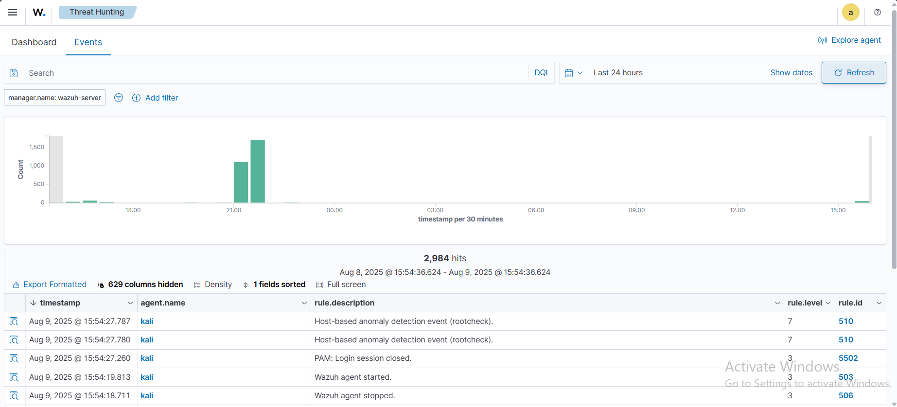

# 🛡️ Detecting Suspicious Binaries

Wazuh’s **Rootcheck** module can detect **suspicious or trojaned binaries** on monitored endpoints.  
A **trojaned binary** is a legitimate system executable whose contents have been replaced with malicious code to trick the system into running it.

In this PoC, we demonstrate replacing a binary on a **Kali Linux** endpoint and detecting it with Wazuh.

---

## 📡 Infrastructure

| Role       | OS / Version     | Description |
|------------|------------------|-------------|
| Victim     | **Kali Linux**    | Runs Wazuh agent and Rootcheck module |

---

## ⚙️ Configuration on Kali Linux Endpoint

1. **Verify Rootcheck is enabled**  
   Open `/var/ossec/etc/ossec.conf` and ensure the following configuration exists:
   ```xml
   <rootcheck>
       <disabled>no</disabled>
       <check_files>yes</check_files>
       <check_trojans>yes</check_trojans>
       <check_dev>yes</check_dev>
       <check_sys>yes</check_sys>
       <check_pids>yes</check_pids>
       <check_ports>yes</check_ports>
       <check_if>yes</check_if>
       <frequency>43200</frequency> <!-- Every 12 hours -->
       <rootkit_files>/var/ossec/etc/shared/rootkit_files.txt</rootkit_files>
       <rootkit_trojans>/var/ossec/etc/shared/rootkit_trojans.txt</rootkit_trojans>
       <skip_nfs>yes</skip_nfs>
   </rootcheck>

---

## 🚀 Attack Emulation

1. **Create a backup of the original binary**

   ```bash
   sudo cp -p /usr/bin/w /usr/bin/w.copy
   ```

2. **Replace the original binary with malicious code**

   ```bash
   sudo tee /usr/bin/w << 'EOF'
   #!/bin/bash
   echo "$(date) this is evil" > /tmp/trojan_created_file
   echo 'test for /usr/bin/w trojaned file' >> /tmp/trojan_created_file
   echo "Now running original binary"
   /usr/bin/w.copy
   EOF
   ```

3. **Force Rootcheck to scan immediately** (instead of waiting 12 hours)

   ```bash
   sudo systemctl restart wazuh-agent
   ```

---

## 📊 Expected Detection

* **Wazuh Rule Match:**

  ```
  location:rootcheck AND rule.id:510 AND data.title:Trojaned version of file detected.
  ```

* **Dashboard Search:**
  Go to **Threat Hunting** → Add filter:

  ```
  location:rootcheck AND rule.id:510
  ```



---
