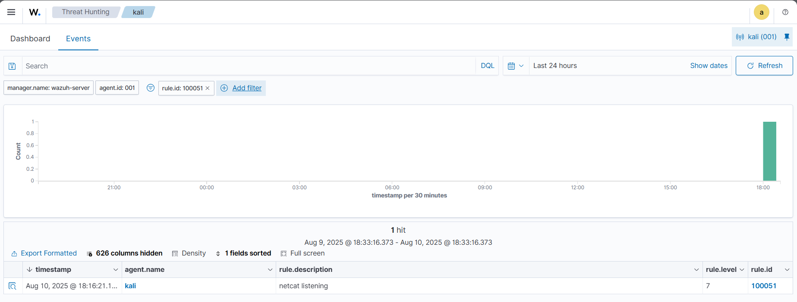

# 🛠️ Detecting Unauthorized Processes

In this project, I configured **Wazuh's Command Monitoring capability** to detect when **Netcat** is running on my Kali Linux endpoint.  

---

## 📍 Infrastructure Setup

| Endpoint      | Description |
|---------------|-------------|
| **Kali Linux** | Configured Wazuh agent to monitor running processes and detect when Netcat is active. |

---

## ⚙️ Configuration – Kali Linux Endpoint

### 1️⃣ Configure Command Monitoring
I edited the Wazuh agent configuration file:
```bash
sudo nano /var/ossec/etc/ossec.conf
````

I added the following block to **periodically list all running processes**:

```xml
<ossec_config>
  <localfile>
    <log_format>full_command</log_format>
    <alias>process list</alias>
    <command>ps -e -o pid,uname,command</command>
    <frequency>30</frequency>
  </localfile>
</ossec_config>
```

Then I restarted the Wazuh agent to apply the changes:

```bash
sudo systemctl restart wazuh-agent
```

---

### 2️⃣ Install Netcat

To emulate an attack scenario, I installed Netcat and dependencies:

```bash
sudo apt install ncat nmap -y
```

---

## ⚙️ Configuration – Wazuh Server

On my Wazuh server, I created custom rules to detect **Netcat** when it’s listening for incoming connections.

I edited:

```bash
sudo nano /var/ossec/etc/rules/local_rules.xml
```

I added:

```xml
<group name="ossec,">
  <rule id="100050" level="0">
    <if_sid>530</if_sid>
    <match>^ossec: output: 'process list'</match>
    <description>List of running processes.</description>
    <group>process_monitor,</group>
  </rule>

  <rule id="100051" level="7" ignore="900">
    <if_sid>100050</if_sid>
    <match>nc -l</match>
    <description>Netcat listening for incoming connections.</description>
    <group>process_monitor,</group>
  </rule>
</group>
```

Finally, I restarted the Wazuh manager:

```bash
sudo systemctl restart wazuh-manager
```

---

## 🧪 Attack Emulation

I simulated a Netcat listener on Kali Linux:

```bash
nc -l 8000
```

(Kept it running for about 30 seconds to allow Wazuh to detect it.)

---

## 📊 Visualizing Alerts

In the **Wazuh Dashboard**, under **Threat Hunting**, I filtered alerts using:

```
rule.id:(100051)
```

This showed the detection event for Netcat running on my monitored endpoint.

---



> ✅ Successfully detected Netcat activity in real time using Wazuh's command monitoring module.

```
