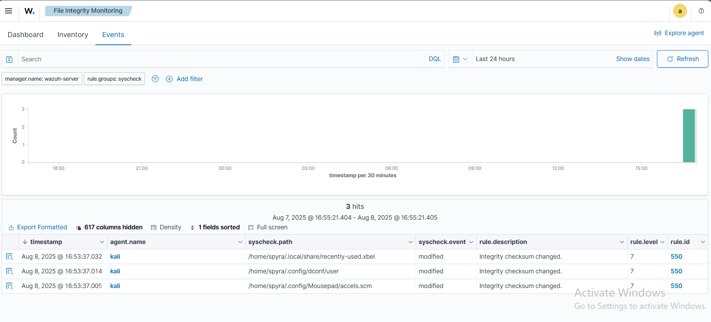

# 🛡️ File Integrity Monitoring (FIM) with Wazuh

**File Integrity Monitoring (FIM)** helps audit sensitive files and meet regulatory compliance requirements.  Wazuh has a built-in FIM module that monitors file system changes to detect **creation, modification, and deletion** of files.

In this guide, we will test the Wazuh FIM module by monitoring a directory on a Kali Linux endpoint.

---

## ⚙️ Configuration on Kali Linux Endpoint

1. **Edit the Wazuh Agent Configuration**
   
   Open the Wazuh agent configuration file:
   ```bash
   sudo nano /var/ossec/etc/ossec.conf
````

2. **Add Directories for Monitoring**
   Inside the `<syscheck>` block, add:

   ```xml
   <directories check_all="yes" report_changes="yes" realtime="yes">/root</directories>
   ```

3. **Restart Wazuh Agent**
   Apply the configuration changes:

   ```bash
   sudo systemctl restart wazuh-agent
   ```

---

## 🧪 Testing the Configuration

Perform the following steps in the monitored `/root` directory:

1. **Create a text file**

   ```bash
   sudo touch /root/testfile.txt
   ```

   Wait **5 seconds**.

2. **Modify the file**

   ```bash
   echo "This is a test" | sudo tee -a /root/testfile.txt
   ```

   Wait **5 seconds**.

3. **Delete the file**

   ```bash
   sudo rm /root/testfile.txt
   ```

---

## 📊 Viewing Alerts in Wazuh Dashboard

* Navigate to the **Threat Hunting** module.
* Use the filter:

  ```
  rule.id:550
  ```
* You will see alerts for **file creation, modification, and deletion**.



