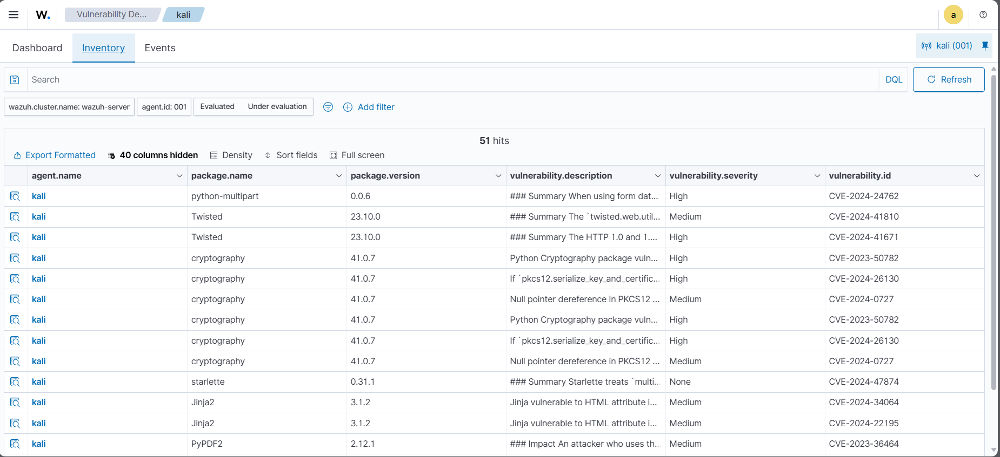

# 🛡️ Wazuh Vulnerability Detection – Identifying CVEs on Kali Linux

In this project, I used the **Wazuh Vulnerability Detection module** to scan my Kali Linux endpoint for **unpatched CVEs** in both the operating system and installed applications.

This helps maintain system security and meet compliance requirements by identifying exploitable software vulnerabilities.

---

## 📍 Infrastructure Setup

| Endpoint       | Description |
|----------------|-------------|
| **Kali Linux** | Wazuh agent configured to report vulnerabilities to the Wazuh server. |

---

## ⚙️ Configuration – Wazuh Server

The Vulnerability Detection module is **enabled by default**, but I confirmed the settings in:

```bash
sudo nano /var/ossec/etc/ossec.conf
````

### ✅ Vulnerability Detection Configuration

```xml
<vulnerability-detection>
   <enabled>yes</enabled>
   <index-status>yes</index-status>
   <feed-update-interval>60m</feed-update-interval>
</vulnerability-detection>
```

---

### ✅ Indexer Configuration

I verified the Wazuh indexer settings:

```xml
<indexer>
  <enabled>yes</enabled>
  <hosts>
    <host>https://127.0.0.1:9200</host>
  </hosts>
  <ssl>
    <certificate_authorities>
      <ca>/etc/filebeat/certs/root-ca.pem</ca>
    </certificate_authorities>
    <certificate>/etc/filebeat/certs/filebeat.pem</certificate>
    <key>/etc/filebeat/certs/filebeat-key.pem</key>
  </ssl>
</indexer>

---

After changes, I restarted the Wazuh Manager:

```bash
sudo systemctl restart wazuh-manager
```

---

## 🧪 Vulnerability Scanning

Once configured, the Wazuh server automatically scanned my Kali Linux endpoint for vulnerabilities in:

* OS packages
* Installed software
* Applications with known CVEs

---

## 📊 Viewing Detected Vulnerabilities

I opened the **Wazuh Dashboard** → **Vulnerability Detection** → **Inventory**
Here, I could see a detailed list of detected CVEs, severity ratings, and affected packages.

---



> ✅ Successfully identified unpatched CVEs on Kali Linux using Wazuh’s Vulnerability Detection module.


